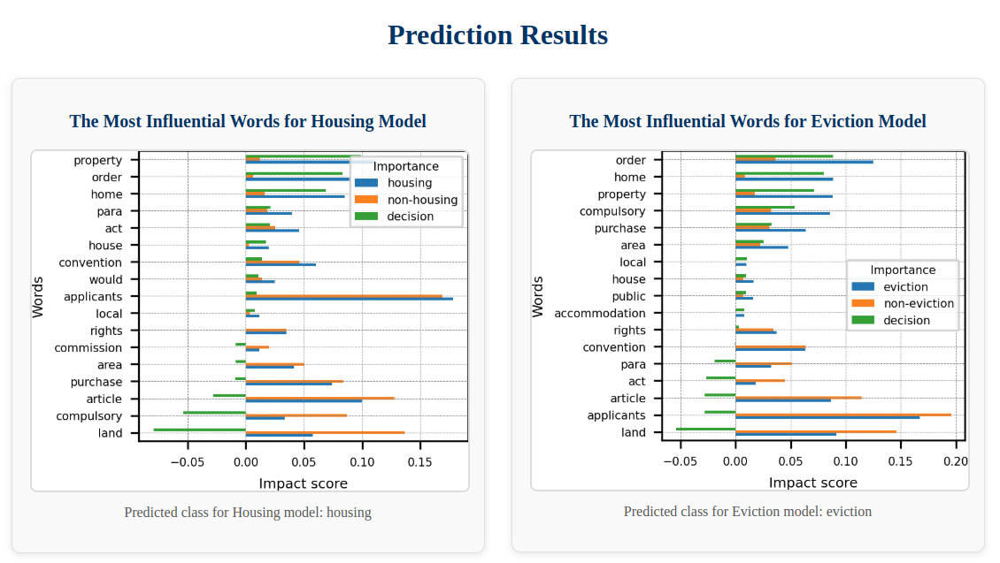

# Housing Eviction Predictor

This is a web application built using **Flask** to help lawyers analyze and classify legal cases. The app predicts whether a case relates to **housing** or **eviction** based on the information provided in a text file. It also visualizes the most influential words from the models used for prediction.

## Features

- **Prediction**: Classify the input case as either a "housing" or "eviction" case based on a trained model.
- **Visualization**: Displays the most influential words for each model used in the prediction.
- **User-friendly Interface**: Upload a text file, select the number of influential words, and receive immediate predictions and visualizations.
  
## Requirements

To run this app locally, make sure you have the following installed:

- **Python 3.x**
- **pip** (Python package installer)

### Dependencies

Install the necessary Python packages by running:

```bash
pip install -r requirements.txt
```

The requirements.txt file includes the necessary dependencies like Flask, Matplotlib, and other libraries required for the app.

## Usage

1. Clone the repository to your local machine:

```bash
git clone https://github.com/yourusername/housing-eviction-predictor.git
cd housing-eviction-predictor
```
2. Install dependencies:

```bash
pip install -r requirements.txt
```

3. Run the Flask application:

```bash
python app.py
```

4. Open your browser and go to:

```arduino
http://127.0.0.1:5000/
```

5. Upload a text file with a legal case description, choose the number of influential words you'd like to display, and submit the form. The app will display the prediction and visualizations of the most influential words for each model.


## File Format

The input text file should be a plain text (.txt) file containing the description of the legal case. The app will process this text to predict if the case is related to housing or eviction.

## Example

This is the visualization generated for a case law which has been predicted (and confirmed by a human annotator) to be about housing and eviction:




## Contributing

Feel free to fork this project and make improvements! If you find bugs or have suggestions for new features, please open an issue or create a pull request.
 
## References

[An explainable approach to detect case law on housing and eviction issues within the HUDOC database]([https://example.com](https://arxiv.org/abs/2410.02978)) - A detailed paper explaining the methodology used for classifying housing and eviction cases.


## License

This project is open-source and available under the MIT License.


